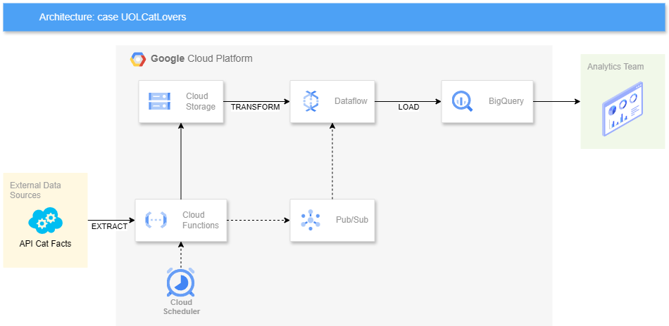

# case-UOLCatLovers

Repositório criado para o case **UOLCatLovers**.


## Contexto de negócio e requisitos

Imagine que você é um engenheiro de dados em uma startup de tecnologia pet chamada “UOLCatLovers”. A UOLCatLovers está desenvolvendo um aplicativo móvel que fornece fatos interessantes sobre gatos para seus usuários. Os fatos são extraídos da API Cat Facts.
Documentação em: https://alexwohlbruck.github.io/cat-facts/docs/

As respostas devem constar em um repositório no GitHub e o link do repositório deve ser compartilhado para a avaliação.
 
1. Como a startup foi recém criada, ainda não há uma grande demanda pelos dados, então você precisa desenvolver um script Python simples que extraía os dados de fatos sobre gatos (cat facts) da API e salva em um arquivo CSV local.
 
2. Com o tempo, o aplicativo ganhou popularidade e o número de fatos sobre gatos cresceu exponencialmente. Agora, a solução local não é mais viável e é necessário transpor a solução para a nuvem. Você precisa projetar uma arquitetura na plataforma Google Cloud que seja capaz de extrair, armazenar e disponibilizar os dados para os times de anaytics. Não é necessário implementar ou codificar, apenas desenhar a arquitetura.
 
3. Com o tempo, o time de analytics também sentiu necessidade de realizar suas próprias consultas sobre os dados, como a tecnologia mais conhecida por eles é o BigQuery, você precisa especificar o esquema da tabela de dados de fatos sobre gatos (cat facts), inclua os campos, tipos de campos e quaisquer outras considerações necessárias. A especificação pode ser feita por diagrama ou por código.
 
> Nota: para as questões a seguir, não é necessário criar uma base de dados no BigQuery ou mostrar os resultados das consultas. Basta ter o código SQL escrito.
 
4. Apesar dos dados no BigQuery, o time de analytics não está conseguindo realizar as consultas por conta própria e pediu sua ajuda. Crie uma consulta que extraia os fatos que foram atualizados em agosto de 2020 para um estudo de caso demandado por eles.
 
5. O time de desenvolvimento soube da sua habilidade com consultas SQL e decidiu se aproveitar da fila de demandas para solicitar uma amostra da base de fatos sobre gatos (cat facts) para popular o ambiente de QA deles. O time solicitou uma consulta SQL que extraia, de forma aleatória, 10% dos registros da base contendo as informações de texto, data de criação e data de atualização. Uma consideração importante feita pelo time de desenvolvimento é que eles precisam da consulta SQL para extrair os dados para um arquivo CSV separado por vírgulas.

## Implementação

### 1 - [Script para coleta de dados](crawler/collect_cat_facts.py)

Este script em Python interage com a API Cat Facts para buscar e salvar fatos sobre vários animais. Os usuários podem escolher entre buscar todos os fatos disponíveis ou um número específico de fatos aleatórios para um tipo de animal específico. Os fatos buscados são então salvos em um arquivo CSV.
Os fatos serão salvos no caminho 'cat_facts.csv'

**Requisitos:**

- Python 3.x
- requests library
- pandas library

**Uso:**

Argumentos de Linha de Comando

```
python collect_cat_facts.py [-h] [--random] [--type TYPE] [--amount AMOUNT] [--append]
```

**Opções:**

- `-h, --help`       Mostra opções de linha de comando.
- `--random`         Busca fatos aleatórios.
- `--type TYPE`      Define tipo de animal para fato aleatório (o padrão é 'gato').
- `--amount AMOUNT`  Define o número de fatos aleatórios a serem buscados (o padrão é 1).
- `--append`         Anexar o resultado ao arquivo csv, se existir (o padrão substituirá o arquivo).

**Exemplos de uso:**

Coleta todos os fatos:

`python collect_cat_facts.py`

Coleta 5 fatos aleatórios para cachorros e anexa resultados em um csv existente:

`python collect_cat_facts.py --type dog --random --amount 5 --append`

### 2 - Diagrama de arquitetura em nuvem (GCP)



**Componentes do Diagrama:**

**External Data Sources (API Cat Facts):**
O ponto de entrada onde os dados de fatos sobre gatos são extraídos da API Cat Facts.

**Cloud Scheduler:**
Aciona periodicamente a Cloud Function para iniciar o processo de extração de dados.

**Cloud Functions:**
Extrai dados da API Cat Facts e armazena em um bucket no Cloud Storage. Também publica uma mensagem no Pub/Sub após a extração.

**Cloud Storage:**
Armazena temporariamente os arquivos CSV com os dados extraídos.

**Pub/Sub:**
Gerencia as mensagens publicadas pela Cloud Function, notificando outros serviços de que novos dados estão disponíveis para processamento.

**Dataflow:**
Consome mensagens do Pub/Sub, lê os dados do Cloud Storage, realiza transformações necessárias e carrega os dados processados no BigQuery.

**BigQuery:**
Armazena os dados estruturados para que a equipe de analytics possa realizar consultas analíticas.

### 3 - Esquema da tabela de fatos

```
CREATE TABLE uolcatlovers.dataset.facts (
    _id STRING NOT NULL,
    user STRING,
    text STRING,
    source STRING,
    type STRING,
    createdAt TIMESTAMP,
    updatedAt TIMESTAMP,
    deleted BOOLEAN,
    used BOOLEAN,
    status STRUCT<
        verified BOOLEAN,
        feedback STRING,
        sentCount INT64
    >
)
PARTITION BY DATE(createdAt);
```

`PARTITION BY DATE(createdAt)`: A tabela será particionada com base na data extraída do campo createdAt. Cada partição corresponderá a uma data específica, o que ajudará na performace quando fizer consultas filtrando pela data dos fatos.

### 4 - Consulta de dados de agosto de 2020

Consulta que extrai os fatos que foram atualizados em agosto de 2020:

```
SELECT *
FROM uolcatlovers.dataset.facts
WHERE DATE(createdAt) BETWEEN '2020-08-01' AND '2020-08-31';
```

### 5 - Consulta de dados com amostra aleatória de 10% dos Registros

Consulta para extrair uma amostra aleatória de 10% dos registros, contendo as informações de texto, data de criação e data de atualização:

```
SELECT text, createdAt, updatedAt
FROM `uolcatlovers.dataset.facts`
WHERE RAND() < 0.10;
```

Para extrair os dados diretamente para um arquivo csv, deve adicionar a instrução [`EXPORT DATA OPTIONS`](https://cloud.google.com/bigquery/docs/reference/standard-sql/other-statements#export_data_statement):

```
EXPORT DATA OPTIONS(
  uri='gs://bucket/folder/sample_data.csv',
  format='CSV',
  overwrite=true,
  header=true,
  field_delimiter=',') AS
SELECT text, createdAt, updatedAt
FROM `uolcatlovers.dataset.facts`
WHERE RAND() < 0.10;
```

Onde:

- `uri='gs://bucket/folder/sample_data.csv'`: O caminho do Google Cloud Storage onde o arquivo CSV será salvo (caminho genérico como exemplo).
- `format='CSV'`: Especifica que o formato de saída é CSV.
- `overwrite=true`: Especifica que se já existir um arquivo com o mesmo nome, ele será sobrescrito.
- `header=true`: Incluir o cabeçalho (nomes das colunas) no arquivo CSV.
- `field_delimiter=','`: Usa vírgula como delimitador de campo.